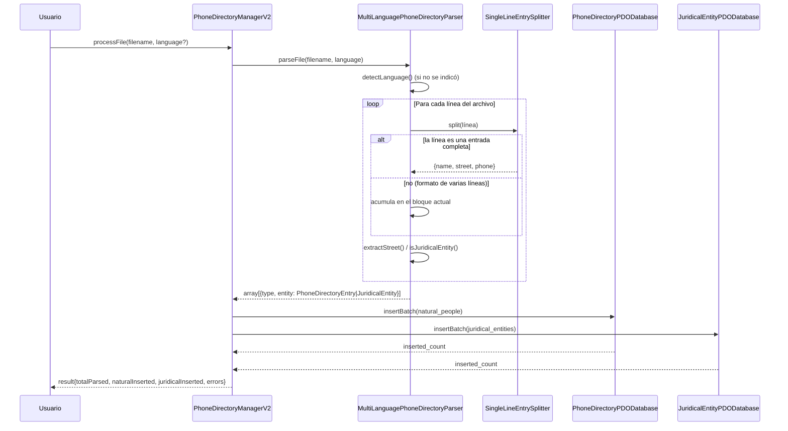
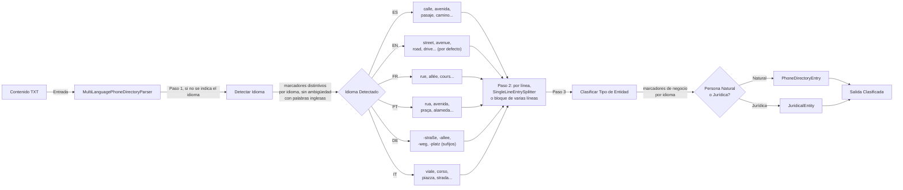
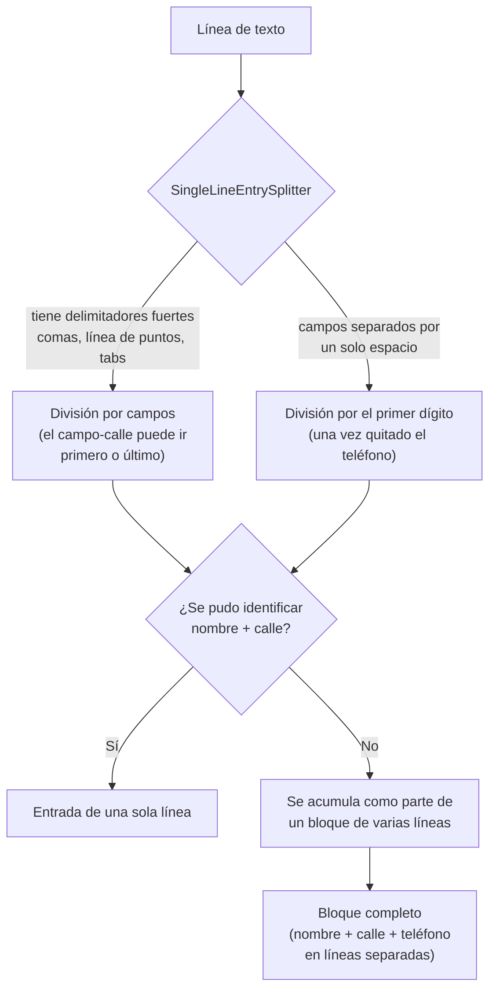
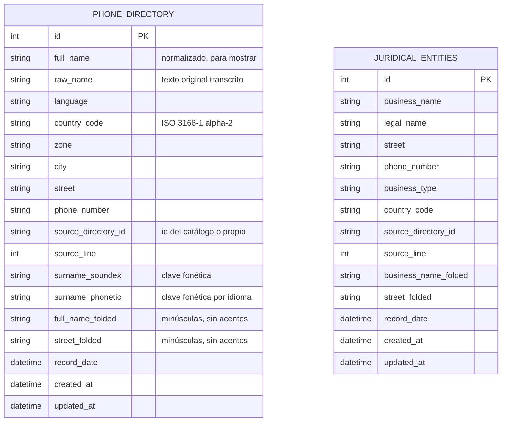
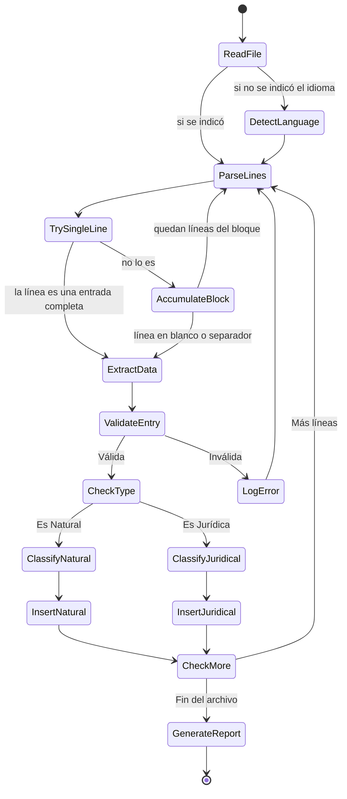
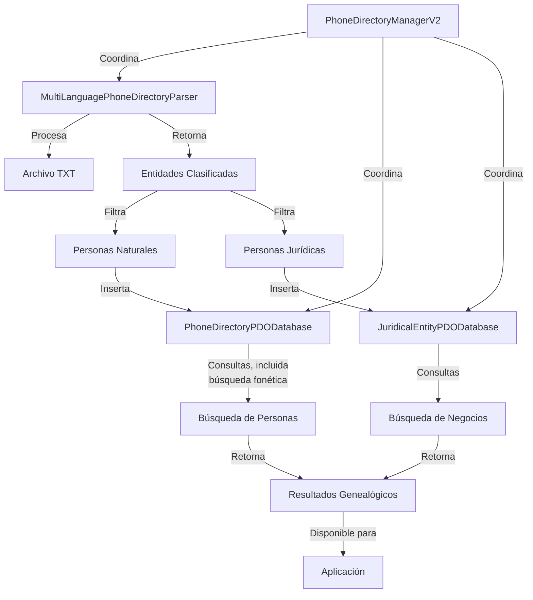
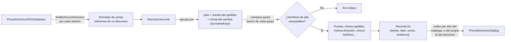
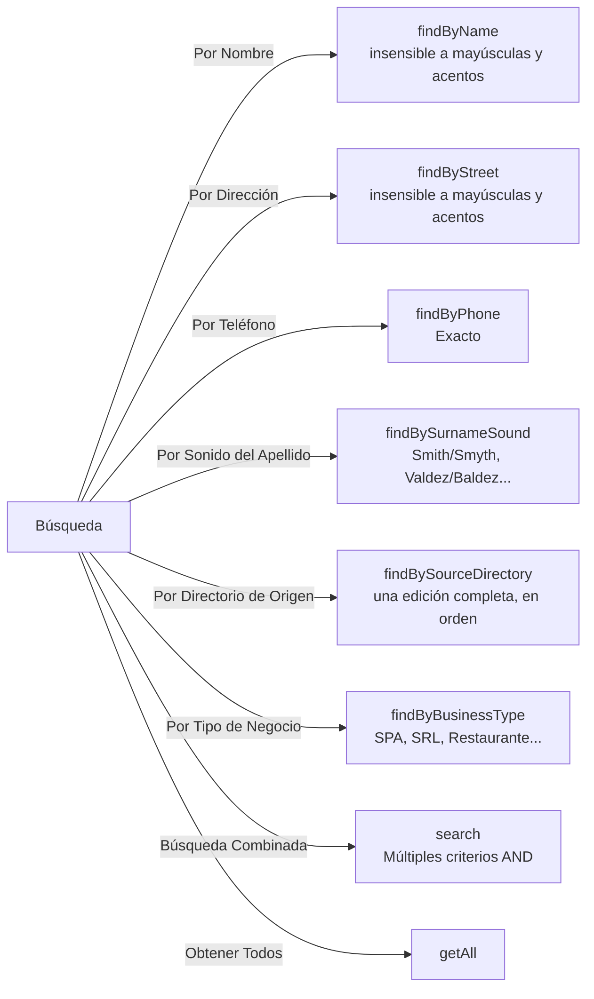

# Arquitectura del Módulo Phone Directory Parser

Módulo para parsear guías telefónicas históricas en múltiples idiomas, extraer datos genealógicos de personas naturales y jurídicas, y almacenarlos en una base de datos relacional (SQLite, MySQL/MariaDB o PostgreSQL).

## Diagrama General del Sistema

```mermaid
graph TD
    A[Archivo TXT<br/>Phone Directory] -->|File I/O| B[PhoneDirectoryParser<br/>o<br/>MultiLanguagePhoneDirectoryParser]

    B -->|una entrada por línea| S[SingleLineEntrySplitter]
    B -->|reconoce teléfonos| PP[PhonePattern]
    S --> B

    B -->|Parsea contenido| C{Detección de<br/>Tipo de Entidad}

    C -->|Persona Natural| D[PhoneDirectoryEntry]
    C -->|Persona Jurídica| E[JuridicalEntity]

    D -->|compone| PN[PersonName]
    D -->|compone| GL[GeoLocation]

    D -->|Almacena vía| SD[SqlDialect]
    E -->|Almacena vía| SD
    SD -->|SQL específico del motor| F[PhoneDirectoryPDODatabase<br/>phone_directory table]
    SD -->|SQL específico del motor| G[JuridicalEntityPDODatabase<br/>juridical_entities table]

    F -->|Consultas| H[PhoneDirectoryManager /<br/>PhoneDirectoryManagerV2]
    G -->|Consultas| H

    F -.->|claves fonéticas| SK[SurnameKeys]
    F -.->|entradas de varios directorios| RL[RecordLinker]
    RL -.->|años de referencia| CAT[PhoneDirectoryCatalog]

    H -->|API de Alto Nivel| I[Aplicación Genealógica]
```



## Flujo de Procesamiento



## Estructura de Clases - Personas Naturales

```mermaid
classDiagram
    class PhoneDirectoryEntry {
        -int id
        -PersonName personName
        -GeoLocation geoLocation
        -string rawName
        -string phoneNumber
        -string sourceDirectoryId
        -int sourceLine
        -DateTime recordDate

        +getId(): int
        +getFullName(): string
        +getFormattedName(): string
        +getRawName(): string
        +getTitle(): ?string
        +getFirstName(): string
        +getLastNames(): array
        +getCountryCode(): string
        +getZone(): ?string
        +getCity(): ?string
        +getStreet(): string
        +getPhoneNumber(): ?string
        +getLanguage(): ?string
        +getSourceDirectoryId(): ?string
        +getSourceLine(): ?int
        +getRecordDate(): DateTime
        +toArray(): array
    }

    class PersonName {
        -array firstNames
        -array lastNames
        -string title
        -string language

        +getFirstNames(): array
        +getLastNames(): array
        +getSurnameRoot(): ?string
        +getTitle(): ?string
        +getFormattedName(): string
    }

    class GeoLocation {
        -string countryCode
        -string zone
        -string city
        -string street

        +getFullAddress(): string
    }

    class PhoneDirectoryParser {
        -string countryCode
        -string sourceDirectoryId
        -array entries
        -array parseErrors

        +static forCatalogDirectory(string): self
        +parseFile(string): array
        +parseContent(string): array
        +getEntries(): array
        +getErrors(): array
        +reset(): void
    }

    class PhoneDirectoryDatabaseInterface {
        <<interface>>
        +connect(): void
        +insert(PhoneDirectoryEntry): int
        +findById(int): ?PhoneDirectoryEntry
        +findByName(string): array
        +findBySurnameSound(string, ?string): array
        +findBySourceDirectory(string): array
        +search(array): array
    }

    class PhoneDirectoryPDODatabase {
        -PDO pdo
        -SqlDialect dialect
        -string dsn

        +createTable(): void
        +insert(PhoneDirectoryEntry): int
        +insertBatch(array): int
        +findById(int): ?PhoneDirectoryEntry
        +findByName(string): array
        +findByStreet(string): array
        +findByPhone(string): ?PhoneDirectoryEntry
        +findBySurnameSound(string, ?string): array
        +findBySourceDirectory(string): array
    }

    PhoneDirectoryEntry *-- PersonName
    PhoneDirectoryEntry *-- GeoLocation
    PhoneDirectoryDatabaseInterface <|.. PhoneDirectoryPDODatabase
    PhoneDirectoryParser -->|crea| PhoneDirectoryEntry
    PhoneDirectoryPDODatabase -->|almacena| PhoneDirectoryEntry
```

## Estructura de Clases - Personas Jurídicas

```mermaid
classDiagram
    class JuridicalEntity {
        -int id
        -string businessName
        -string legalName
        -string street
        -string phoneNumber
        -string businessType
        -string countryCode
        -string sourceDirectoryId
        -int sourceLine
        -DateTime recordDate

        +getId(): int
        +getBusinessName(): string
        +getLegalName(): ?string
        +getStreet(): string
        +getPhoneNumber(): ?string
        +getBusinessType(): ?string
        +getCountryCode(): string
        +getSourceDirectoryId(): ?string
        +getSourceLine(): ?int
    }

    class JuridicalEntityDatabaseInterface {
        <<interface>>
        +connect(): void
        +insert(JuridicalEntity): int
        +findById(int): ?JuridicalEntity
        +findByBusinessName(string): array
        +findByBusinessType(string): array
        +search(array): array
    }

    class JuridicalEntityPDODatabase {
        -PDO pdo
        -SqlDialect dialect
        -string dsn

        +createTable(): void
        +insert(JuridicalEntity): int
        +insertBatch(array): int
        +findById(int): ?JuridicalEntity
        +findByBusinessName(string): array
        +findByStreet(string): array
        +findByPhone(string): ?JuridicalEntity
        +findByBusinessType(string): array
    }

    JuridicalEntityDatabaseInterface <|.. JuridicalEntityPDODatabase
    JuridicalEntityPDODatabase -->|almacena| JuridicalEntity
```

## Arquitectura del Parser Multiidioma



Sin ningún marcador reconocido, o en caso de empate, el idioma detectado es siempre inglés (el idioma base del proyecto), nunca el primero de la lista por casualidad.

## Formatos de Entrada



## Esquema de Base de Datos



Las dos tablas son independientes entre sí (no hay relación declarada); cada una se consulta por separado desde `PhoneDirectoryManagerV2`. `createTable()` agrega automáticamente, con sus índices, cualquier columna de esta lista que falte en una tabla creada por una versión anterior del módulo, y recalcula su valor para las filas existentes.

## Ciclo de Vida del Procesamiento



## Integración con Manager



## Enlace de Registros Entre Directorios



Agrupar por país, sonido de apellido e inicial del nombre reduce cuánto hay que comparar sin descartar ningún enlace válido: el propio criterio de comparación ya exige que los nombres de pila compartan esa inicial.

## Patrones de Búsqueda Soportados



## Características Principales

### 1. **Dos formatos de entrada**
- Un campo por línea (formato clásico) y una entrada por línea (el más común en guías digitalizadas), detectados automáticamente por `SingleLineEntrySplitter`

### 2. **Detección Automática de Idioma**
- Marcadores distintivos por idioma, sin ambigüedad con palabras inglesas comunes; por defecto, inglés
- Soporta: Español, Inglés, Francés, Portugués, Alemán, Italiano

### 3. **Nombres**
- `PersonName` separa nombre, apellido(s) y tratamiento (Mr., Mrs., Vda. de...)
- Reconoce partículas (de, van, von...) y el número de apellidos según el idioma

### 4. **Clasificación Automática de Entidades**
- Distingue entre personas naturales y jurídicas
- Detecta tipo de negocio cuando corresponde

### 5. **Tres Motores de Base de Datos**
- SQLite, MySQL/MariaDB y PostgreSQL, con las diferencias de SQL encapsuladas en `SqlDialect`
- Migración automática de columnas nuevas sobre una tabla ya existente

### 6. **Almacenamiento Separado**
- Tabla `phone_directory` para personas naturales
- Tabla `juridical_entities` para entidades comerciales

### 7. **Búsqueda Flexible**
- Por nombre o dirección (parcial, insensible a mayúsculas y acentos)
- Por teléfono (exacto)
- Por sonido del apellido (variantes ortográficas)
- Combinada, con múltiples criterios

### 8. **Enlace de Registros**
- `RecordLinker` propone qué entradas de distintas ediciones son la misma persona, con puntuación y evidencia

### 9. **Manejo Robusto de Errores**
- Registra errores sin detener el procesamiento
- Proporciona información de línea y contexto

## Índices de Base de Datos

Los nombres de índice incluyen la tabla (`idx_phone_directory_street`, no `idx_street`), porque SQLite y PostgreSQL comparten el espacio de nombres de índices entre tablas de la misma base de datos.

```sql
-- Personas Naturales
CREATE INDEX idx_phone_directory_full_name ON phone_directory(full_name);
CREATE INDEX idx_phone_directory_country_code ON phone_directory(country_code);
CREATE INDEX idx_phone_directory_street ON phone_directory(street);
CREATE INDEX idx_phone_directory_phone_number ON phone_directory(phone_number);
CREATE INDEX idx_phone_directory_source_directory_id ON phone_directory(source_directory_id);
CREATE INDEX idx_phone_directory_surname_soundex ON phone_directory(surname_soundex);
CREATE INDEX idx_phone_directory_surname_phonetic ON phone_directory(surname_phonetic);
CREATE INDEX idx_phone_directory_full_name_folded ON phone_directory(full_name_folded);
CREATE INDEX idx_phone_directory_street_folded ON phone_directory(street_folded);

-- Personas Jurídicas
CREATE INDEX idx_juridical_entities_business_name ON juridical_entities(business_name);
CREATE INDEX idx_juridical_entities_street ON juridical_entities(street);
CREATE INDEX idx_juridical_entities_phone_number ON juridical_entities(phone_number);
CREATE INDEX idx_juridical_entities_business_type ON juridical_entities(business_type);
CREATE INDEX idx_juridical_entities_country_code ON juridical_entities(country_code);
CREATE INDEX idx_juridical_entities_source_directory_id ON juridical_entities(source_directory_id);
CREATE INDEX idx_juridical_entities_business_name_folded ON juridical_entities(business_name_folded);
CREATE INDEX idx_juridical_entities_street_folded ON juridical_entities(street_folded);
```

## Casos de Uso Genealógicos

### 1. **Búsqueda de Antepasados (incluidas variantes ortográficas)**
```php
$results = $manager->findByName('Garcia'); // encuentra "García" también
$results = $manager->findBySurnameSound('Valdez', 'es'); // encuentra "Baldez" también
```

### 2. **Análisis por Localidad**
```php
$results = $manager->findByStreet('Main Street');
// Personas que vivían en esa calle
```

### 3. **Búsqueda de Negocios Familiares**
```php
$businesses = $manager->getAllJuridicalEntities();
$results = $manager->searchJuridicalEntities(['businessName' => 'García']);
```

### 4. **Importación Masiva de Directorios**
```php
$parser = MultiLanguagePhoneDirectoryParser::forCatalogDirectory('es_1930_madrid');
$result = $manager->processFile('historical_directory_1930.txt');
echo "Agregadas: {$result['totalInserted']} entradas";
```

### 5. **Seguir a una persona entre ediciones**
```php
$entries = array_merge(
    $db->findBySourceDirectory('es_1930_madrid'),
    $db->findBySourceDirectory('es_1975_national')
);
$links = (new RecordLinker())->link($entries);
// $links[0]->earlier, ->later, ->score, ->evidence
```

## Extensibilidad

El diseño modular permite:
- Agregar nuevos idiomas en `MultiLanguagePhoneDirectoryParser` (marcadores de calle, tipo de entidad y conteo de apellidos)
- Implementar nuevas bases de datos heredando de las interfaces, o agregando un nuevo motor a `SqlDialect`
- Personalizar el parsing según formato específico
- Agregar búsquedas avanzadas en el Manager

## Licencia

MIT
