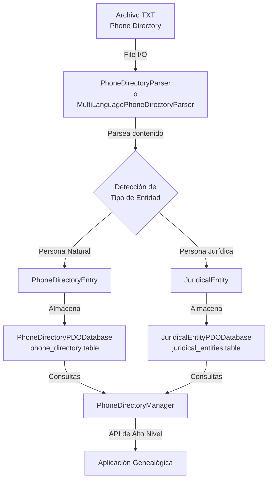
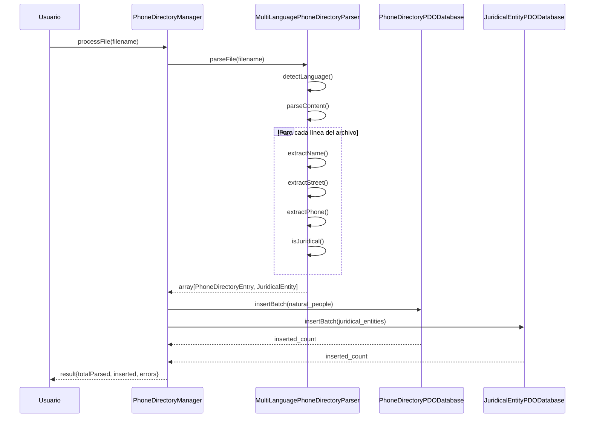
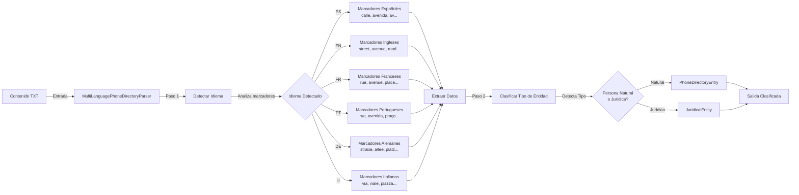
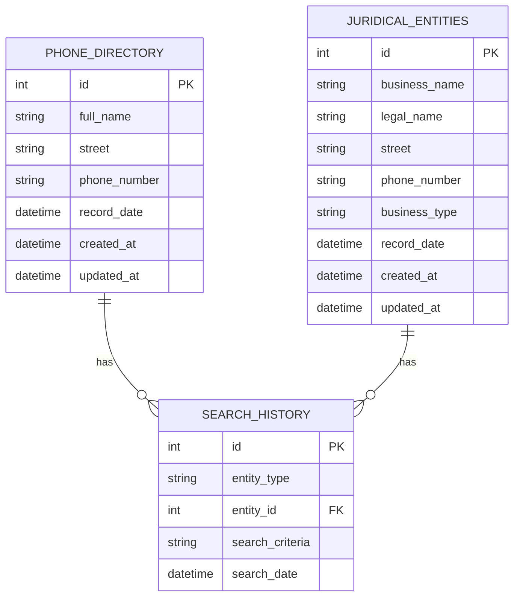
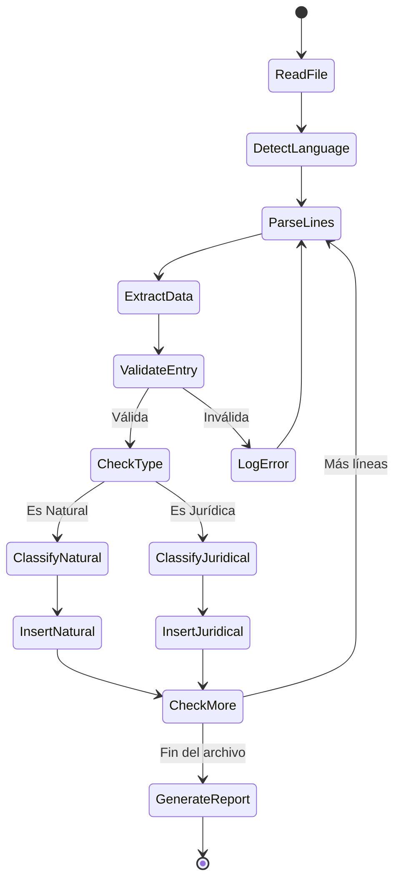
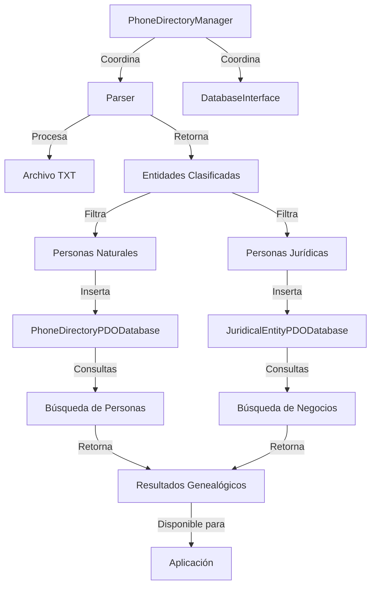
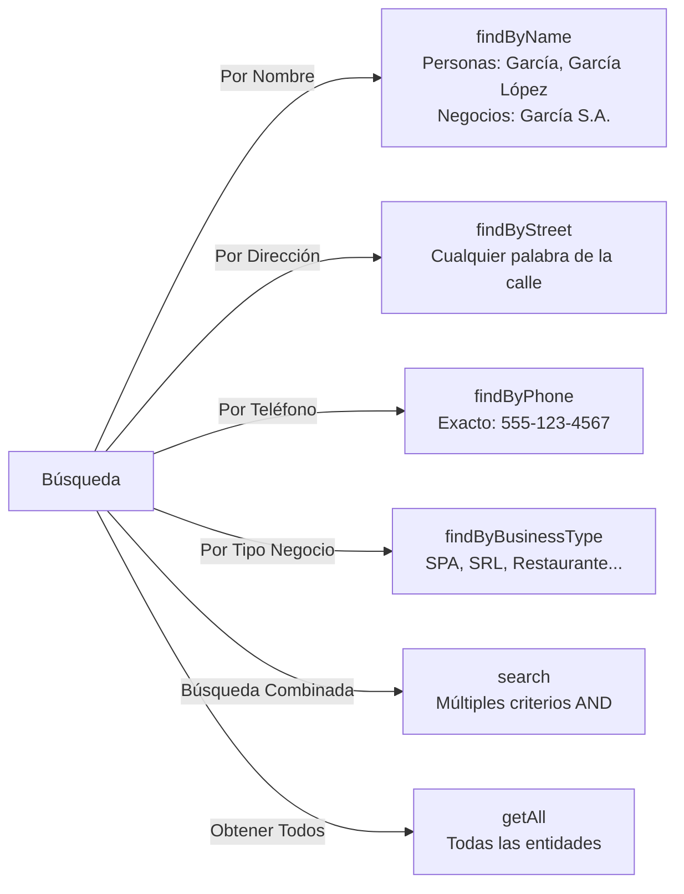

# Arquitectura del Módulo Phone Directory Parser

Módulo para parsear guías telefónicas en múltiples idiomas, extraer datos genealógicos de personas naturales y jurídicas, y almacenarlos en una base de datos relacional.

## Diagrama General del Sistema



## Flujo de Procesamiento



## Estructura de Clases - Personas Naturales

```mermaid
classDiagram
    class PhoneDirectoryEntry {
        -int id
        -string fullName
        -string street
        -string phoneNumber
        -DateTime recordDate
        
        +getId(): int
        +getFullName(): string
        +getStreet(): string
        +getPhoneNumber(): ?string
        +getRecordDate(): DateTime
        +toArray(): array
    }
    
    class PhoneDirectoryParser {
        -array entries
        -array parseErrors
        
        +parseFile(string): array
        +parseContent(string): array
        +getEntries(): array
        +getErrors(): array
        +reset(): void
    }
    
    class PhoneDirectoryDatabaseInterface {
        <<interface>>
        +connect(): void
        +insert(PhoneDirectoryEntry): int
        +findById(int): ?PhoneDirectoryEntry
        +findByName(string): array
        +search(array): array
    }
    
    class PhoneDirectoryPDODatabase {
        -PDO pdo
        -string dsn
        
        +insert(PhoneDirectoryEntry): int
        +insertBatch(array): int
        +findById(int): ?PhoneDirectoryEntry
        +findByName(string): array
        +findByStreet(string): array
        +findByPhone(string): ?PhoneDirectoryEntry
    }
    
    PhoneDirectoryDatabaseInterface <|.. PhoneDirectoryPDODatabase
    PhoneDirectoryParser -->|crea| PhoneDirectoryEntry
    PhoneDirectoryPDODatabase -->|almacena| PhoneDirectoryEntry
```

## Estructura de Clases - Personas Jurídicas

```mermaid
classDiagram
    class JuridicalEntity {
        -int id
        -string businessName
        -string legalName
        -string street
        -string phoneNumber
        -string businessType
        -DateTime recordDate
        
        +getId(): int
        +getBusinessName(): string
        +getLegalName(): ?string
        +getStreet(): string
        +getPhoneNumber(): ?string
        +getBusinessType(): ?string
    }
    
    class JuridicalEntityDatabaseInterface {
        <<interface>>
        +connect(): void
        +insert(JuridicalEntity): int
        +findById(int): ?JuridicalEntity
        +findByBusinessName(string): array
        +findByBusinessType(string): array
        +search(array): array
    }
    
    class JuridicalEntityPDODatabase {
        -PDO pdo
        -string dsn
        
        +insert(JuridicalEntity): int
        +insertBatch(array): int
        +findById(int): ?JuridicalEntity
        +findByBusinessName(string): array
        +findByStreet(string): array
        +findByPhone(string): ?JuridicalEntity
        +findByBusinessType(string): array
    }
    
    JuridicalEntityDatabaseInterface <|.. JuridicalEntityPDODatabase
    JuridicalEntityPDODatabase -->|almacena| JuridicalEntity
```

## Arquitectura del Parser Multiidioma



## Esquema de Base de Datos



## Ciclo de Vida del Procesamiento



## Integración con Manager



## Patrones de Búsqueda Soportados



## Características Principales

### 1. **Detección Automática de Idioma**
- Analiza marcadores específicos del idioma
- Soporta: Español, Inglés, Francés, Portugués, Alemán, Italiano

### 2. **Clasificación Automática de Entidades**
- Distingue entre personas naturales y jurídicas
- Detecta tipo de negocio cuando corresponde

### 3. **Almacenamiento Separado**
- Tabla `phone_directory` para personas naturales
- Tabla `juridical_entities` para entidades comerciales

### 4. **Búsqueda Flexible**
- Búsqueda por nombre (parcial)
- Búsqueda por dirección (parcial)
- Búsqueda por teléfono (exacto)
- Búsqueda combinada con múltiples criterios

### 5. **Manejo Robusto de Errores**
- Registra errores sin detener el procesamiento
- Proporciona información de línea y contexto

## Índices de Base de Datos

Para optimizar búsquedas en grandes volúmenes:

```sql
-- Personas Naturales
CREATE INDEX idx_full_name ON phone_directory(full_name);
CREATE INDEX idx_street ON phone_directory(street);
CREATE INDEX idx_phone_number ON phone_directory(phone_number);

-- Personas Jurídicas
CREATE INDEX idx_business_name ON juridical_entities(business_name);
CREATE INDEX idx_street ON juridical_entities(street);
CREATE INDEX idx_phone_number ON juridical_entities(phone_number);
CREATE INDEX idx_business_type ON juridical_entities(business_type);
```

## Casos de Uso Genealógicos

### 1. **Búsqueda de Antepasados**
```php
$results = $manager->findByName('García');
foreach ($results as $entry) {
    echo $entry->getFullName() . ', ' . $entry->getStreet();
}
```

### 2. **Análisis por Localidad**
```php
$results = $manager->findByStreet('Main Street');
// Personas que vivían en esa calle
```

### 3. **Búsqueda de Negocios Familiares**
```php
$businesses = $manager->getJuridicalEntities();
$results = $manager->search(['businessName' => 'García']);
```

### 4. **Importación Masiva de Directorios**
```php
$result = $manager->processFile('historical_directory_1950.txt');
echo "Agregadas: {$result['insertedCount']} entradas";
```

## Extensibilidad

El diseño modular permite:
- Agregar nuevos idiomas en `MultiLanguagePhoneDirectoryParser`
- Implementar nuevas bases de datos heredando de interfaces
- Personalizar parsing según formato específico
- Agregar búsquedas avanzadas en el Manager

## Licencia

MIT
